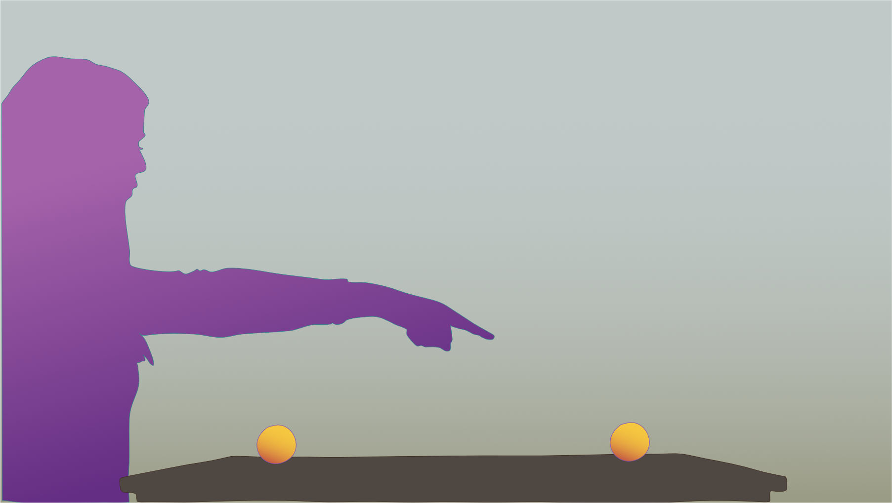
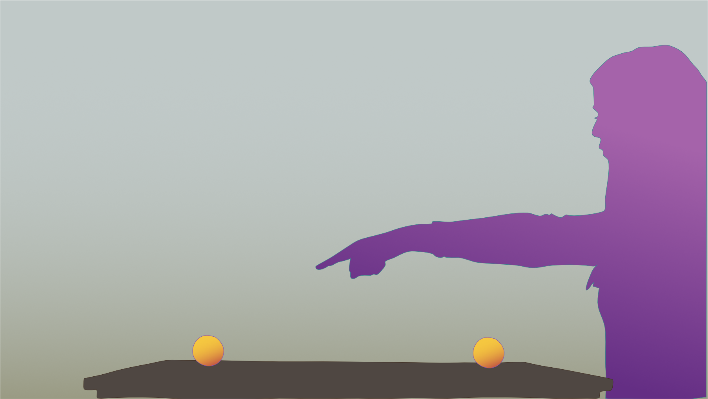

```{r setup, include = FALSE}
# Loading packages 
# NOTE: this will install these packages on your machine in case they are missing
if (!require(papaja)) install.packages('papaja'); library(papaja)
if (!require(tidyverse)) install.packages('tidyverse'); library(tidyverse)
# if (!require(lme4)) install.packages('lme4'); library(lme4)
# if (!require(beeswarm)) install.packages('beeswarm'); library(beeswarm) # for APA-style beeplots
if (!require(afex)) install.packages('afex'); library(afex) # aov functions
if (!require(lsr)) install.packages('lsr'); library(lsr) # Analysis, CohenD
# if (!require(kableExtra)) install.packages('kableExtra'); library(kableExtra) # for tables with images
if (!require(magick)) install.packages('magick'); library(magick) # for cropping plots
if (!require(ggsci)) install.packages('ggsci'); library(ggsci) # colour schemes for ggplot2
if (!require(rstatix)) install.packages('rstatix'); library(rstatix) # required for rounding pvalues

```

```{r analysis-preferences}
# Seed for random number generation
set.seed(42)
knitr::opts_chunk$set(cache.extra = knitr::rand_seed)
```

```{r readdata, include = FALSE}

# read data
raw.data <- read.csv("./data/schmischmu-cleandata.csv")
# raw.data$agegroup <- ifelse(raw.data$agegroup == "adult", "adult", "child")  # too few 5 and 6yo for individual groups

# prepare data - mutate to correct data type
test.data <- raw.data %>% 
  dplyr::filter(agecat != "teen") %>% 
# rename sex
  mutate(sex =   case_when(
    sex == "female" ~ "female",
    sex == "diverse" ~ "unknown",
    TRUE ~ "male")) %>% 
# rename method
  mutate(method =   case_when(
    method == "adultonline" ~ "online_website",
    method == "blossin" ~ "in_person",
    method == "zoom" ~ "online_call",
    TRUE ~ "online_website")) %>%
# turn variables into factors for analyses
  mutate(sex = as.factor(sex),
         method = as.factor(method),
         condition = as.factor(condition),
         id = as.factor(id), 
         agecat = as.factor(agecat))%>% 
# relevel factors for analyses
  mutate(condition = relevel(condition, ref = "complex labeling"), 
         agecat = relevel(agecat, ref = "adult"), 
         sex = relevel(sex, ref = "female") 
        ) %>% 
# scale trial
  mutate(z.trial = as.vector(scale(trial)))

```

# Introduction

<!-- Intro and Discussion Write up can be found here (not the current -->
<!-- version): -->
<!-- <https://docs.google.com/document/d/18ZZ4q9CqeFUhDsVBJxjUJBeLg2NpxSTer29tztJ1uos/edit?usp=sharing> -->

Demonstratives such as *this* and *that* are among the first words children use in their early language production, being often the first noncontent words uttered along with pointing gestures [@clark_strategies_1978; @diessel_demonstratives_2006; @kita_pointing_2003; but cf. @gonzalez-pena_acquisition_2020]. Typically, demonstratives occur in pairs marking a distance contrast (“here”/“there”, “this”/“that”), and are thought to provide a conceptual frame of reference emerging prior to all other frames [@tanz_studies_1980]. Linguistic research on spatial indexicals and psychological research on joint attention suggest that spatial indexicals constitute a universal class of expressions of fundamental significance for cognition [@diessel_demonstratives_2014]. Demonstratives are language universal [@wierzbicka_semantics_1996; @diessel_demonstratives_2006; @levinson_demonstratives_2018; @coventry_spatial_2023]. In exophoric use, they function as spatial deictic expressions to point to a location or an object relative to the deictic center, i.e., the speaker [@levinson_space_2003].

Most languages worldwide use two or three terms to mark different distances from the speaker deictically and to refer to the same individual from different perceptual situations [@shopen_deixis_1985; @coventry_spatial_2023]. Unlike other spatial expressions, demonstratives are very old, probably older than all other functional words [@diessel_demonstratives_2014]. They are the primary source of functional morpheme development and do not derive from other word roots [@diessel_demonstratives_2006]. 

Despite their linguistic peculiarity and evident centrality to human communication, few studies investigated how children learn demonstratives. Extant studies suggest that adult-like uses of demonstratives are the result of protracted development [@gonzalez-pena_acquisition_2020], with various aspects of their meaning being learned subsequently [@de_villiers_this_1974; @webb_stages_1976].

## Experimental work on the acquisition of demonstratives

Empirical studies on the development of children’s comprehension and production of the terms “this/that” are relatively sparse. Results from studies with English-speaking children suggest that this development extends over several years. @de_villiers_this_1974 examined English-speaking children ranging in age from 2 to 4 years. Comprehension and production of “this” and “that” were tested in a hide-and-seek game where the experimenter sat beside or opposite the child. Results revealed that children as young as 3 years of age showed high performance rates („this“: 80%, „that“: 91%) in the comprehension task that required translation from the experimenter's perspective to their own perspective. Performance in the production task differed as a function of the experimenter's sitting position; for example, 3-year-old children performed better when the experimenter sat next to them („this“: 75%, „that“: 80%) than when the experimenter sat opposite them („this“: 80%, „that“: 50%).  

@webb_stages_1976 investigated the acquisition of the terms “this”/“that” in English-speaking children of ages 4 and 7 years, also in a comprehension and a production task. Children‘s performance in the comprehension task was better for the word „that“ („this“: 66%, „that“: 73%), it was better when experimenter and child had the same perspective („this“: 83%, „that“: 68%) than when they faced each other („this“: 48%, „that“: 78%), and it was better for the 7-year-old children („this“: 73%, „that“: 78%) compared to the 4-year-old children („this“: 58%, „that“: 67%). 

@clark_strategies_1978 presented English-speaking children aged 2 to 4 years with a game in which they had to decide which of two toys to move, testing their comprehension of demonstratives. The experimenter sat beside the child or on the opposite side of the table, facing the child. Children's performance increased with age (e.g., 3-year-olds: „this“: 56%, „that“: 51%; 4-year-olds: „this“: 75%, „that“: 76%), and children were more likely to answer correctly to the word „this“ with the experimenter next to them („this“: 83%, „that“: 42%), but were more frequently correct on the word „that“ with the experimenter facing them („this“: 51%, „that“: 85%). Only 5 of 36 children appeared to have a complete understanding of the terms „this“ and „that“. 

In a recent study by @gonzalez-pena_acquisition_2020, the production of the terms “this/that” was investigated in English-speaking children ages 7 and 11. In two experiments, children were asked to tell a puppet, which supposedly understood only the words "this one" and "that one", which of two identical-looking dinosaurs "jumped" along a wooden bar extending from the child. In the first experiment, in which only the dinosaurs were used, the 11-year-old children used the term "this" more often for positions that were closer to them and the term "that" more often for positions that were further away from them. This was not the case for the 7-year-old children. In addition, there was a trend across both age groups to use the term „this“ more often for the chosen dinosaur, irrespective of its distance from the child. In a second experiment, the stimulus value was increased by combining the dinosaur figure with a token of economic value. This resulted in a stronger effect of "ownership" compared to the first experiment (the term "this" was used significantly more often for the chosen dinosaur). Moreover, not only the 11-year-old children but also the 7-year-old children used the term "this" more frequently for positions closer to them and the term "that" more frequently for positions farther away from them. According to @gonzalez-pena_acquisition_2020, these results suggest that distinctions in demonstrative production emerge around the age of 7, assuming sampling differences as the reason for the variation between experiments.

In sum, the results of studies exploring the development of comprehension and production of the terms “this/that” in English-speaking children are inconclusive. English-speaking children may begin to distinguish between these terms in comprehension and production as early as age 3 [@de_villiers_this_1974], although other findings suggest that this does not occur until age 7 ([@gonzalez-pena_acquisition_2020; @webb_stages_1976].

Findings from studies with children speaking languages other than English also do not allow to draw clear conclusions regarding the development of comprehension and production of the terms analogous to "this/that". Comprehension of such terms was found to be above chance in 5-year-old Mandarin-speaking children, even when the terms were uttered by a speaker with a different perspective [@chu_childrens_2018]. Regarding production, Turkish-speaking children have been reported to acquire the basic distinction between specific terms for objects that are close and far from themselves at age 4 [@kuntay_learning_2006]. In contrast, this competence has been reported in 6- to 8-year-old but not in 3- to 5-year-old Spanish-speaking children [@shin_demonstratives_2020].

## Theoretical Considerations

Notably, it is a characteristic aspect of the meaning of demonstratives that speakers have to use different words to refer to the same thing from different perspectives and may refer to different things using the same word from different perspectives. What one speaker refers to by saying “this” or “here”, another speaker, standing some distance away, has to refer to by saying “that” or “there”---equally in the case of just one speaker who changes her position. Demonstratives need to be *substituted* for each other in characteristic ways.

Demonstratives played a special role in twentieth-century analytic philosophy because they were seen in close connection with the fundamental ability to refer to or think about objects in the world [@russell_denoting_1905; @searle_intentionality_1983; @strawson_individuals_1959; @quine_word_1960; @donnellan_reference_1966; @tugendhat_vorlesungen_1976; @tugendhat_traditional_2016; @kripke_naming_1980; @evans_varieties_1982]. Russell, who sought to understand reference by explaining the function of proper names, held that the "ambiguous proper name" “this” is the only logically proper name that refers directly. He concluded that all references to spatiotemporal objects must be demonstratively-perceptually grounded by the demonstrative term "this", giving momentary names [@russell_denoting_1905]. 

Like Russell, @strawson_individuals_1959 pointed out that reference to objects relies on demonstratives. However, he did not understand demonstratives as momentary names, but, in contrast, he focused on the specific indexicality of demonstratives and characterised identification/individuation as resulting from demonstrative acts which fix referents in the local context of speaker-utterances. Tugendhat went further still by elucidating a system of spatiotemporal relations that is not only fixed by using a demonstrative in a particular perceptual situation but by using a substitutional system of inter-defined demonstrative terms [@tugendhat_vorlesungen_1976; @tugendhat_traditional_2016]. 

Tugendhat argued that an intersubjective spatiotemporal framework for locating objects unambiguously in space is basic for object identification/individuation, and such a system is established by mastering the substitution rules specific to spatial indexical terms. The meaning of “this”, for instance, is only understood by a speaker who grasps that, from her perspective, “this” denotes the object denoted by “that” from her interlocutor’s perspective. The perceptual situation in which “this” is used contrasts with another situation in which the same object is referred to by saying “that”. If one does not know that “this” is to be systematically substituted for “that”, one does not grasp the meaning of either [@tugendhat_vorlesungen_1976; @tugendhat_traditional_2016]. Following this line of thought, singular referring terms play a basic role in thinking about objects [also cf. @perry_problem_1979; @hildebrandt_becoming_2023; @hildebrandt_rethinking_2023].

The ability to use two different words for the same thing---as is the case for “this” and “that” when used by speakers to talk about the same thing from different positions---has been tested in non-indexical contexts. There is evidence that being able to use/understand two alternative labels (dual-naming/synonymy) is much more demanding than comprehension and production of one label for objects and is associated with ToM capacities [@perner_theory_2002]. When children begin to label objects with one word around the age of 12 to 18 months, they operate with the strong assumption that each object has only one label or name [mutual exclusivity bias; @merriman_mutual_1989; @markman_use_2003; @halberda_development_2003]: For example, if a child already knows the word "ball" and is shown a new object, they are more inclined to assign a new label, such as "dax," to the unfamiliar object instead of calling it a "ball" as well. This bias, which aids in efficiently mapping words to the objects in their environment, must be overcome if the substitution principle of indexicals is to be applied correctly.

In sum, spatial indexicals comprise the following decisive semantic features: they are context-sensitive in that their referents change from situation to situation. They mark a distance contrast relative to the speaker. And they must be substituted for each other to refer to the selfsame object from different positions. To our knowledge, the substitution aspect has not yet been investigated. Test conditions involving one or more speakers talking about the same thing from different positions would allow probing children’s understanding of the substitution aspect of spatial indexicals’ meaning. 

## This study

To test not only the substitution knowledge of children incorporated in the concrete terms “this” and “that” but also to determine whether children can employ a systematic rule-based substitution that goes beyond the context of familiar words, we chose to integrate a pseudo-word condition. Pseudo-words such as “Schmi”, i.e., phonologically viable forms that are not in the lexicon of a given language, are used extensively in linguistic and psycholinguistic experiments. Children who encounter pseudo-words cannot rely on their existing vocabulary or experience with these words. By comparing children's performance with pseudo-words and actual words, we aim to conclude whether children possess a flexible understanding of the semantic substitution structures of indexicals independent of specific words [@klasen_learners_2023].

As target objects, we have used two identical-looking balls placed symmetrically on a table with no further distinguishing features in the background to ensure that participants make responses based on the objects’ distances to the speaker, not based on an object’s salience or preferences for an object’s or its surrounding features. The study employs the one-speaker version of demonstrative substitution. That is, in the whole experiment, one speaker referred to the target objects from different positions. The study was restricted to one-speaker substitution because participants might assume that two speakers use the same words with slightly different meanings, presenting the additional difficulty of having to decide whether they employ the same or alternative meanings.

As a control, we have devised a condition in which children are not forced to include the speaker's spatial perspective and which does not require the ability to substitute expressions. This condition resembles a labeling or naming condition in which a word such as “cat” has to be associated with an object kind. However, because no external distinguishing features are apparent in the objects to be labeled, the task is more complex than ordinary labeling. It requires considering objects’ position and resembles tasks involving relational properties (e.g., grandma's favourite ball) or dispositional properties (e.g., magnetism). Such tasks are referred to here as *complex labelling tasks*.

Studies show that the development of comprehension and production of the terms “this/that” occurs primarily between 3 and 7 years of age (see above). Since substitution is a demanding semantic feature, we want to investigate whether children in the upper range of the age window are capable of demonstrative comprehension, including substitution. In addition, we have included adults to estimate proficient performance in the presented tasks.

## Hypotheses

Consistent with existing studies of demonstrative comprehension and following from the complexity of demonstratives’ substitution aspect, we assumed that children (5-7) do not fully master the usage rules of ordinary nor pseudo-word demonstratives. Moreover, we assume that children of that age have remaining difficulties with complex labeling tasks. Thus, we hypothesize that children perform significantly less accurately than adults in all conditions (H1).

Children in the upper acquisition age range should partly understand demonstratives' meaning. They might, nonetheless, lack a flexible understanding of the semantic substitution structures of demonstratives. Understanding pseudo-word demonstratives, independent of already learned words, would thus be more difficult for children than understanding demonstratives. Therefore, we assume that children perform significantly more accurately in the demonstrative condition than in the pseudo-word demonstrative condition (H2). 

Moreover, the complex labeling condition does not require a substitution rule. Therefore, we hypothesize that children perform significantly more accurately in the complex labeling condition than in both other conditions (H3). 

# Methods

## Participants

```{r demographics_agecat, echo=FALSE}

demographics_agecat_total <- raw.data %>% 
  distinct(id, .keep_all = TRUE) %>% # select only one line per participant
  filter(agecat!="teen") %>% # exclude children that do not match age range
  mutate(agecat = recode(agecat, 
                         "child" = "Child", 
                         "adult" = "Adult"),
         condition = recode(condition, 
                            "complex labeling" = "Complex Labeling", 
                            "demonstrative" = "Demonstrative",
                            "pseudo-word demonstrative" = "Pseudo-word Demonstrative")) %>%
  group_by(agecat) %>%
  summarize(
    N = length(id),
    female = sum(sex=="female"),
    'M age' = round(mean(age), 2),
    'Min age' = min(age),
    'Max age' = max(age),
    'SD age' = round(sd(age), 2)
  )

# demographics_agecat_total$N[1] # adults
# demographics_agecat_total$N[2] # children

demographics_excluded <- raw.data %>%
  distinct(id, .keep_all = TRUE) %>% # select only one line per participant
  filter(agecat=="teen") %>% # exclude children that do not match age range
  summarize(
    N = length(id),
    female = sum(sex=="female"),
    'M age' = round(mean(age), 2),
    'Min age' = min(age),
    'Max age' = max(age),
    'SD age' = round(sd(age), 2)
  )

# demographics_excluded$N
# demographics_excluded$female 

demographics_agecat_bycondition <- raw.data %>%
  distinct(id, .keep_all = TRUE) %>% # select only one line per participant
  filter(agecat!="teen") %>% # exclude children that do not match age range
  mutate(agecat = recode(agecat, 
                         "child" = "Child", 
                         "adult" = "Adult"),
         condition = recode(condition, 
                            "complex labeling" = "Complex Labeling", 
                            "demonstrative" = "Demonstrative",
                            "pseudo-word demonstrative" = "Pseudo-word Demonstrative")) %>%
  group_by(agecat, condition) %>%
  dplyr::summarize(
    N = length(id),
    female = sum(sex=="female"),
    'M age' = round(mean(age), 2),
    'Min age' = min(age),
    'Max age' = max(age),
    'SD age' = round(sd(age), 2)
  )
# descriptives[, -1] <- printnum(descriptives[, -1]

# unique(raw.data$method)

demographics_method <- raw.data %>%
  distinct(id, .keep_all = TRUE) %>% # select only one line per participant
  filter(agecat!="teen") %>% # exclude children that do not match age range
  dplyr::summarize(
    N = length(id),
    zoom = length(which(method=="zoom")),
    blossin = length(which(method=="blossin")),
    online = length(which(method=="online")),
    adultonline = length(which(method=="adultonline"))
  )
```

A total of `r demographics_agecat_total$N[2]` children and `r demographics_agecat_total$N[1]` adults were tested in a 2x3 between-subjects design (see Table 1). The total sample size was based on standard practices in the field. With this sample size, G\*Power sensitivity analyses indicated that the *t*-tests testing our three main hypotheses were able to detect large effect sizes of Cohen’s d $\geq$ 0.87 (H1: three one-tailed *t*-tests with Bonferroni-corrected alpha-level of .5/3, power of 80%, group sizes of 24 and 25 participants each), Cohen’s d $\geq$ 0.72 (H2: one one-tailed *t*-test with an alpha level of 0.5, power of 80%, and group sizes of 24 and 25 participants), and Cohen’s d $\geq$ 0.82 (H3: two one-tailed *t*-tests with Bonferroni-corrected alpha-level of .5/2, power of 80%, and group sizes of 24 and 25 participants). Children were recruited online, in MASKED FOR REVIEW, a medium-sized Central European city, or in a test centre in MASKED FOR REVIEW, being visited by kindergarten groups from MASKED FOR REVIEW. Children in MASKED FOR REVIEW were contacted via a database of participants for child development studies to which their parents had voluntarily signed up. Appointments were made based on parents’ and children’s availability. The socio-economic status of families was not recorded. Still, the test center is visited by children with diverse backgrounds, generally representing the ethnic and socio-economic range of a suburban-to-rural region in Central Europe. All studies described below were reviewed and approved by an internal ethics committee at the MASKED FOR REVIEW. Adult participants were recruited online. Data collection took place from March to December 2021. In addition, `r demographics_excluded$N` children (`r demographics_excluded$female` female) were tested but not submitted to the final sample for not fitting into the planned age range.

```{r demtab, echo=FALSE}
apa_table(
  demographics_agecat_bycondition,
  caption = "Demographics - age categories by condition",
  note = "",
  escape = FALSE,
  placement = "h"
)
```

## Procedure and Setup

Following the rules at the MASKED FOR REVIEW during the SARS-CoV-2 pandemic, the study was conceptualized as an online experiment. The study was advertized through social media channels and email lists. Parents could either follow a link and let their children participate in the experiment whenever convenient (N = `r demographics_method$online`), or they were asked to make an appointment for a video call during which an experimenter assisted in the experiment (N = `r demographics_method$zoom`). Due to difficulties in the online acquisition of participants, the study was conducted with mobile devices in a test center in MASKED FOR REVIEW when regulations allowed face-to-face contact with children (N = `r demographics_method$blossin`). In the online version, the experiment began with a written introduction for parents, explaining how the experiment was conducted and expressing that children could break off participation at any time. In the face-to-face version, experimenters explained the experiment and the possibility of leaving at any time to the participating children. Parents or experimenters helped children operate the device on which experiments ran. All adults were tested online.

Three conditions were tested between-subject. In all conditions, video recordings of an experimenter demonstrated how a pair of words is used to refer to two visually identical balls lying on the table before her. The conditions were distinguished by which pair of words was used and by these words’ meaning rule. In the first condition, the demonstrative condition, “dies” (German for “this”) and “das” (German for “that”) were used in their ordinary usage (see above). In the second condition, the pseudo-word demonstrative condition, the pseudo-words “schmi” and “schmu” were used with the meaning rule of demonstratives. In the third condition, the complex labeling condition, the same pseudo-words were used with a simpler meaning rule requiring only the temporary association of the word to a ball on one side of the table. The experimenter then expressed a preference for one of the balls, and during a still image, children were asked to click the preferred ball. The children observed the scene side-on (see Table \@ref(tab:exp)). Three variables with two values each were counterbalanced for the trials, giving eight trials per condition. The trials varied in whether the experimenter started from the left or right side, whether she introduced “schmi” or “schmu” (“this” or “that”) first, and whether she asked for schmi or schmu (this or that) first. In the pseudo-word demonstrative condition, schmi was always the proximal object to match the phonetic properties of “this” versus “that”.

## Stimulus Material

In each trial, participants were presented with a series of brief video sequences in which an experimenter demonstrated the meaning of a pair of words (“schmi”/“schmu” or “this”/“that”) pointing at one of two identical-looking balls. The balls were placed symmetrically on a table, and the experimenter first demonstrated what she meant by each word from one side of the table and then from the other. The experimenter then changed sides again and said she would like to have schmi/schmu (this/that). Participants were then asked to click the ball the experimenter wanted to have (see Table \@ref(tab:exp)).

| Demonstrative                                                             | Pseudo-word Demonstrative                                                     | Complex Labeling                                                            |
|-------------------------|-----------------------|------------------------|
| {width="5cm"}  | {width="5cm"} | {width="5cm"}  |
| "that" | "schmu" | "schmu" |
| {width="5cm"} | {width="5cm"} | {width="5cm"} |
| "this" | "schmi" | "schmi" |
| {width="5cm"} | {width="5cm"}  | {width="5cm"} |
| "that" | "schmu" | "schmi" |
| {width="5cm"} | {width="5cm"} | {width="5cm"}|
| "this" | "schmi" | "schmu" |
| {width="5cm"} | {width="5cm"} | {width="5cm"} |
| "I would like to have this one." | "I would like to have schmi." | "I would like to have schmi." |
| {width="5cm"} | {width="5cm"} | {width="5cm"} |
| "I would like to have that one." | "I would like to have schmu." | "I would like to have schmu. |

Table:(#tab:exp) Schematic presentation of experimental setup in the three conditions. In the experiment, the sides (left/right) from which the experimenter started, the first demonstrated word (this/that, schmi/schmu), and the first word used in the request were counterbalanced between trials.

<!-- +++ description of conditions ?-->

## Coding

Understanding the substitution aspect of demonstratives requires understanding that the same object must be referred to using different words from different perspectives. Thus, an understanding of the substitution aspect of demonstratives is indicated by an ability to select the same ball in subsequent requests employing other words from different standpoints. Correspondingly, an understanding of “schmi” and “schmu” in the complex labeling condition requires being able to select different balls for subsequent requests employing other words. Thus, in all conditions, only when the target ball was successfully selected for both requests in a trial was it coded as a success.

## Analyses

We fitted our data in a three-by-two ANOVA, allowing for an interaction between the factors Condition (demonstrative, pseudo-word demonstrative, complex labeling) and Age group (adult, child). We then proceeded to test our hypotheses post-hoc with one-tailed unpaired *t*-tests. Welch's *t*-tests for unequal variances were used where necessary. All analyses were run in R [@R-base] using the stats package for analyses and ggplot2 [@R-ggplot2] and ggsci [@R-ggsci] for visualization. Data and manuscript were prepared using the tidyverse and papaja packages [@R-papaja, @R-tidyverse].

## Results

### Overview

```{r prepare_overviewtestables, echo = FALSE, include=FALSE}

# str(raw.data)

# aggregate proportion of correct choices and number of trials for each individual
overview.ind.test.data  <- raw.data %>% 
  group_by(agecat, condition, id) %>%
  arrange(agecat, condition) %>%
  dplyr::summarise("correct" = mean(correct_all),
            "trials" = max(trial))

# library(scales) 
# if (!require(rstatix)) install.packages('rstatix'); library(rstatix) # alternative to scales
# required for rounding pvalues, is part of tidyverse but needs to be loaded again; this occurs when functions are overwritten multiple times
# if (!require(lsr)) install.packages('lsr'); library(lsr) # Analysis, CohenD

overviewtestable <- overview.ind.test.data %>%
  filter(agecat!="teen") %>% # exclude children that do not match age range
  group_by(agecat, condition) %>%
  dplyr::summarise(N = n_distinct(id),
            "trials/N" = round(sum(trials)/n_distinct(id), 2),
            "M" = round(mean(correct)*100, 2),
            "SD" = round(sd(correct)*100, 2)
            # p = p_mark_significant(p_round(t.test((correct), mu = 0.25)$p.value, digits =3), cutpoints = c(0, 0.001, 0.01, 0.05, 1), symbols = c("***", "**", "*", "")),
            # df= t.test((correct), mu = 0.5)$parameter,
            # "t(23)" = round(t.test((correct), mu = 0.25)$statistic, 2),
            # d = round(cohensD((correct), mu = 0.25), 2)
            )

 #p = pvalue(t.test((correct), mu = 0.25)$p.value, accuracy = .001),

# ### Maybe LATER add binomial for every individual

# ### run binomial on individual performance
# overview.ind.binom.data <- raw.data %>%
#      filter(agecat != "teen") %>% # exclude children that do not match age range
#      select(condition, agecat, id, correct_all) %>%
#      group_by(condition, agecat, id) %>%
#      summarise("% correct" = round(mean(correct_all)*100, 2),
#                "sum correct" = sum(correct_all),
#                "sum trials" = length(correct_all),
#                "p" = round(binom.test(sum(correct_all), length(correct_all),
#                                 p = 0.5, alternative = "greater")$p.value, 3),
#                "sig" = if_else(p < 0.05, 1, 0)
#                )
# 
# # count successful individuals and create proportions
# overview.sum.binom.data <- overview.ind.binom.data %>%
#    group_by(condition, agecat) %>%
#    summarise(N = n_distinct(id),
#            successful  = as.integer(sum(sig))) %>%
#    mutate("% successful" = round((successful/N)*100), 2)
# 
# # add binomial results to the
# overviewtestable <- cbind(overviewtestable, "N suc" = overview.sum.binom.data$successful, "% suc" = overview.sum.binom.data$"% successful")
```

```{r overviewtab, echo=FALSE}

apa_table(
  overviewtestable,
  caption = "Overview of Performance in Test Trials",
  note = "Table provides the number of participants (N) for all experimental groups, as well as the percentage (M) and standard deviation (SD) of correct choices. Data for each child was averaged across trials.",
  escape = TRUE, # if TRUE special Latex characters are escaped
  placement = "h", # position of table in page:  exact location (h), at the top (t), bottom (b)
  font_size = "footnotesize" # options are tiny, scriptsize, footnotesize, small, normalsize (default), large, Large, LARGE, huge, Huge
  )

```

Adults gave `r overviewtestable$M[1]`% correct answers in the complex labeling condition, `r overviewtestable$M[2]`% correct answers in the demonstrative condition, and `r overviewtestable$M[3]`% correct answers in the pseudo-word demonstrative condition. This is interpreted as proficient performance in the presented task. Children performed less successfully in all conditions (complex labeling: `r overviewtestable$M[4]`%; demonstrative: `r overviewtestable$M[5]`%; pseudo-word demonstrative: `r overviewtestable$M[6]`%) (see Table \@ref(tab:overviewtab) and Figure \@ref(fig:plotting1)).

```{r plotting1, fig.cap="Distribution of participants' percentage of correct trials per condition and age group", echo=FALSE}
# agecats, correct trials

plot.data <- raw.data %>%
  filter(agecat != "teen") %>% # exclude children that do not match age range
  select(id, agecat, condition, correct_all) %>%
  mutate(agecat = recode(agecat, 
                         "child" = "Child", 
                         "adult" = "Adult"),
         condition = recode(condition, 
                            "complex labeling" = "Complex Labeling", 
                            "demonstrative" = "Demonstrative",
                            "pseudo-word demonstrative" = "Pseudo-word Demonstrative")) %>%
  group_by(agecat, condition, id) %>%
  dplyr::summarise(proportion.correct = round(mean(correct_all)*100, 2))

firstplot <- ggplot(plot.data, aes(x = condition, y = proportion.correct, colour = condition, fill = condition)) +
  geom_violin(alpha = 0.3) +
  geom_boxplot(alpha = 0.1) +
  geom_hline(yintercept=50, linetype="dashed", color = "black") +
  geom_jitter(height = 0.1, width = 0.2, size = 2, alpha = 1,) +
  stat_summary(fun=mean, geom="point", shape=20, size=8) +
  coord_cartesian(ylim = c(0, 100)) +
  scale_color_npg() +
  scale_fill_npg() +
  theme_gray() +
  theme(legend.position = "bottom") +
  scale_y_continuous(name = "Proportion Correct") +
  labs(x = "Condition", 
       y = "Proportion Correct",
       title = "Proportion of participants' correct trials by condition and age group",
       #caption = "Distribution of participants' proportion of correct trials per condition and age category"
       ) + 
  facet_wrap(~ agecat, ncol = 1) 
firstplot

ggsave("proportioncorrect.tiff", path = "./images", width = 9, height = 8, device='tiff', dpi=300)
```


```{r anova_overall, echo=FALSE, include=FALSE}

# aggregate data
agg.data <- test.data %>% 
  group_by(id, agecat, condition) %>% 
  dplyr::summarise(correct = mean(correct_all))

# run ANOVA
aov.model <- aov(correct ~ condition*agecat, data = agg.data)

# # Get results for writing
# if (!require(report)) install.packages('report'); library(report)
# summary(aov.model)
# report(aov.model)
# aov.model

```

### Hypotheses testing

We found a significant and strong main effect of condition (F(2, 141) = 17.26, p < .001; $\eta^{2}{p}$ = 0.20, 95% CI [0.10, 1.00]) as well as of age-group (F(1, 141) = 210.27, p < .001; $\eta^{2}{p}$ = 0.60, 95% CI [0.52, 1.00]). However, as the interaction between both terms was significant (F(2, 141) = 6.02, p = .003; $\eta^{2}{p}$ = 0.08, 95% CI [0.02, 1.00]), the effect of condition differed across both age-groups. To answer our hypothesis, we proceeded with post-hoc tests.

#### H1: Children perform significantly less accurately than adults in all conditions.

```{r H1, echo=FALSE}

test.data.H1.labeling <- agg.data %>%
  filter(condition=='complex labeling') %>%
  group_by(agecat)
ttest_H1_labeling <- t.test(correct ~ agecat, data=test.data.H1.labeling, alternative = 'greater')
effectsize_H1_labeling <-  round(cohensD(correct ~ agecat, data=test.data.H1.labeling), 2)

test.data.H1.pseudodem <- agg.data %>%
  filter(condition=='pseudo-word demonstrative') %>%
  group_by(agecat)
ttest_H1_pseudodem <- t.test(correct ~ agecat, data=test.data.H1.pseudodem, alternative = 'greater')
effectsize_H1_pseudodem <-  round(cohensD(correct ~ agecat, data=test.data.H1.pseudodem), 2)

test.data.H1.demonstrative <- agg.data %>%
  filter(condition=='demonstrative') %>%
  group_by(agecat)
ttest_H1_demonstrative <- t.test(correct ~ agecat, data=test.data.H1.demonstrative, alternative = 'greater')
effectsize_H1_demonstrative <-  round(cohensD(correct ~ agecat, data=test.data.H1.demonstrative), 2)
   

# ttest_H1_naming <- t.test(
#   aggregate(data=raw.data[raw.data$agecat=="child" & raw.data$condition=="complex labeling",], correct_all ~ date, mean)$correct_all, 
#   aggregate(data=raw.data[raw.data$agecat=="adult" & raw.data$condition=="complex labeling",], correct_all ~ date, mean)$correct_all)
# 
# ttest_H1_indexical <- t.test(
#   aggregate(data=raw.data[raw.data$agecat=="child" & raw.data$condition=="pseudo-word demonstrative",], correct_all ~ date, mean)$correct_all, 
#   aggregate(data=raw.data[raw.data$agecat=="adult" & raw.data$condition=="pseudo-word demonstrative",], correct_all ~ date, mean)$correct_all)
# 
# ttest_H1_demonstrative <- t.test(
#   aggregate(data=raw.data[raw.data$agecat=="child" & raw.data$condition=="demonstrative",], correct_all ~ date, mean)$correct_all, 
#   aggregate(data=raw.data[raw.data$agecat=="adult" & raw.data$condition=="demonstrative",], correct_all ~ date, mean)$correct_all)
```

Children perform significantly less accurately than adults in the complex labeling
condition, `r apa_print(ttest_H1_labeling)$statistic`, d = `r effectsize_H1_labeling`, in the pseudo-word demonstrative
condition, `r apa_print(ttest_H1_pseudodem)$statistic`, d = `r effectsize_H1_pseudodem`, as well as in
the demonstrative condition, `r apa_print(ttest_H1_demonstrative)$statistic`, d = `r effectsize_H1_demonstrative`. H1 could be confirmed.

#### H2: Children perform significantly more accurately in the demonstrative (dies/das) condition than in the pseudo-word demonstrative (schmi/schmu) condition.

```{r H2, echo=FALSE}
ttest_H2 <- t.test(
  aggregate(data=raw.data[raw.data$agecat=="child" & raw.data$condition=="demonstrative",], correct_all ~ date, mean)$correct_all, 
  aggregate(data=raw.data[raw.data$agecat=="child" & raw.data$condition=="pseudo-word demonstrative",], correct_all ~ date, mean)$correct_all)
# no sign. difference between pseudo-word demonstrative and demonstrative condition
```

Results revealed no significant difference between children's
performance in the demonstrative and pseudo-word demonstrative condition,
`r apa_print(ttest_H2)$statistic`. H2 could not be confirmed. 

#### H3: Children perform significantly more accurately in the complex labeling condition than in both other conditions.

<!-- (non-parametric(?), three-level ANOVA) -->

```{r H3, echo=FALSE, include=FALSE}

test.data.H3.pseudodem <- agg.data %>%
  filter((condition=='pseudo-word demonstrative' | condition=='complex labeling') & agecat=='child') %>%
  group_by(condition)
test.data.H3.pseudodem$condition <- droplevels(test.data.H3.pseudodem$condition)
ttest_H3_pseudodem <- t.test(correct ~ condition, data=test.data.H3.pseudodem, alternative = 'greater')
effectsize_H3_pseudodem <- round(cohensD(correct ~ condition, data=test.data.H3.pseudodem), 2)

test.data.H3.demonstrative <- agg.data %>%
  filter((condition=='demonstrative' | condition=='complex labeling') & agecat=='child') %>%
  group_by(condition)
test.data.H3.demonstrative$condition <- droplevels(test.data.H3.demonstrative$condition)
ttest_H3_demonstrative <-t.test(correct ~ condition, data=test.data.H3.demonstrative, alternative = 'greater')
effectsize_H3_demonstrative <- round(cohensD(correct ~ condition, data=test.data.H3.demonstrative), 2)
   

# aov_H3 <- (afex::aov_ez(id = "date", dv = "correct_all", data = raw.data[raw.data$agecat=="child",], between = "condition", fun_aggregate = mean))
# 
# ttest_H3_namingVSindex <- t.test(
#   aggregate(data=raw.data[raw.data$agecat=="child" & raw.data$condition=="complex labeling",], correct_all ~ date, mean)$correct_all, 
#   aggregate(data=raw.data[raw.data$agecat=="child" & raw.data$condition=="pseudo-word demonstrative",], correct_all ~ date, mean)$correct_all)
# # good: p-value survives any correction for multiple testing
# 
# ttest_H3_namingVSdemon <- t.test(
#   aggregate(data=raw.data[raw.data$agecat=="child" & raw.data$condition=="complex labeling",], correct_all ~ date, mean)$correct_all, 
#   aggregate(data=raw.data[raw.data$agecat=="child" & raw.data$condition=="demonstrative",], correct_all ~ date, mean)$correct_all)
# # also here. good: p-value survives any correction for multiple testing

```

One-tailed two-sample *t*-tests showed that responses were more accurate in the complex labeling than in the pseudo-word demonstrative condition, `r apa_print(ttest_H3_pseudodem)$statistic`, d = `r effectsize_H3_pseudodem` as well as in the complex labeling than in the demonstrative condition, `r apa_print(ttest_H3_demonstrative)$statistic`, d = `r effectsize_H3_demonstrative`. H3 could be confirmed.

### Discussion

The results show that 5- to 7-year-old children perform less accurately than adults in all conditions. In particular, they have difficulties understanding spatial demonstratives (`r overviewtestable$M[5]`% correct trials) and pseudo-word spatial demonstratives (`r overviewtestable$M[6]`% correct trials). This corresponds to the expectations derived from extant findings on the acquisition of demonstratives [@de_villiers_this_1974; @webb_stages_1976; @clark_strategies_1978; @gonzalez-pena_acquisition_2020], on children’s difficulties applying two labels to one object (object kind) [@perner_theory_2002; @merriman_mutual_1989; @markman_use_2003; @halberda_development_2003], and the theoretically derived complexity of demonstratives’ substitution aspect [@tugendhat_vorlesungen_1976; @tugendhat_traditional_2016; @hildebrandt_becoming_2023; @hildebrandt_rethinking_2023]. 

The assumption that pseudo-word demonstratives are even more challenging to understand than ordinary demonstratives could not be confirmed for the tested age range. Using pseudo-words does not appear to make recognizing the substitution rule more difficult. As argued, this would be expected if children in that age range had already partially understood demonstratives, allowing them to answer some requests correctly that involve familiar demonstratives. Because correctness rates are similarly low in both conditions, we interpret these findings as showing that children aged 5 to 7 years not only lack a flexible understanding of the semantic substitution features of demonstratives but do not understand demonstrative substitution at all under tested conditions. The substitution rule of demonstratives appears to pose a major obstacle for learning demonstratives.

As hypothesized, children perform significantly more accurately in the complex labelling condition than in both other conditions. Nonetheless, children answer correctly significantly less often than adults. We interpret these results as follows. In the case of complex labelling, children need not apply a substitution rule. Adhering to the mutual exclusivity of labeling suffices to perform correctly in the complex labelling condition. However, this condition differs from simple labelling---such as when children learn words for different kinds of animals: the labelled objects have the same superficial properties and differ only in their position in space. Moreover, no other differences were presented, like dispositional properties (magnetism, ability to emit sounds), ownership (my ball, Marie's ball), or specific histories that could have been used to mark each ball differentially. The lack of (easily observable or unobservable) distinguishing features complicates correct labeling. Therefore, children still find it more difficult than adults to understand requests in the complex labelling condition.

Overall, 5- to 7-year-old children do not appear to understand the meaning rule of demonstratives, nor do they apply a labelling rule to the full extent. Exploratory analyses of the response patterns will shed some initial light on children's strategies for selecting responses.

## Exploratory Analyses

Three ad-hoc hypotheses were tested to see whether children followed particular strategies for selecting responses: (i) children select responses randomly for each request (random choice), (ii) children tend to select the ball closer to the speaker (proximity bias), (iii) for the second request, children tend to select the ball not selected in their first response (mutual exclusivity bias). For hypotheses (ii) and (iii), an index was calculated for each child, indicating to what extent selecting the ball proximal to the speaker exceeds selecting the distal ball and whether children selected both balls within a trial more often than the same ball twice. These hypotheses were tested using two-tailed one-sample *t*-tests against chance (exploratory analysis (i)) and against a neutral index (exploratory analyses (ii) and (iii), see below).

### Random Choice

(i)	If children respond randomly to each request, they should choose each ball with an equal probability of 50% in each request. Trials should correspondingly be answered correctly with a probability of 25% because each trial consists of two requests which would be answered independently.

```{r prepare_randomchoicetab, echo = FALSE, include=FALSE}

# str(raw.data)

# library(scales) 
# required for rounding pvalues, is part of tidyverse but needs to be loaded again; this occurs when functions are overwritten multiple times
# if (!require(rstatix)) install.packages('rstatix'); library(rstatix) # alternative to scales

# aggregate proportion of correct choices and number of trials for each individual

randomchoice.ind.test.data  <- raw.data %>% 
  group_by(agecat, condition, id) %>%
  arrange(agecat, condition) %>%
  dplyr::summarise("correct_first" = mean(correct_first), 
                   "correct_second" = mean(correct_second),
                   "correct_all" = mean(correct_all), 
                   "trials" = max(trial))

randomchoice.responses  <- randomchoice.ind.test.data %>% 
  dplyr::rename(correct_trial = correct_all) %>%
  pivot_longer(cols = c(correct_first, correct_second, correct_trial), names_to ="response", values_to = "correct") %>%
  filter(agecat=="child" & response!="correct_trial") %>%
  group_by(condition, response) %>%
  arrange(condition, response) %>%
  dplyr::summarise("N" = n_distinct(id),
                   "M" = round(mean(correct)*100, 2),
                   "SD" = round(sd(correct)*100, 2),
                   "p" = p_mark_significant(p_format(t.test((correct), mu = 0.5)$p.value, digits =3, accuracy = 1e-03, leading.zero = FALSE), cutpoints = c(0, 0.001, 0.01, 0.05, 1), symbols = c("***", "**", "*", ""))) %>%
  ungroup()

randomchoice.trials  <- randomchoice.ind.test.data %>% 
  dplyr::rename(correct_trial = correct_all) %>%
  pivot_longer(cols = c(correct_first, correct_second, correct_trial), names_to ="response", values_to = "correct") %>%
  filter(agecat=="child" & response=="correct_trial") %>%
  group_by(condition, response) %>%
  arrange(condition, response) %>%
  dplyr::summarise("N" = n_distinct(id),
                   "M" = round(mean(correct)*100, 2),
                   "SD" = round(sd(correct)*100, 2),
                   "p" = p_mark_significant(p_format(t.test((correct), mu = 0.25)$p.value, digits =3, accuracy = 1e-03, leading.zero = FALSE), cutpoints = c(0, 0.001, 0.01, 0.05, 1), symbols = c("***", "**", "*", "")))%>%
  ungroup()

df_list <- list(randomchoice.responses, randomchoice.trials)
randomchoice <- df_list %>% 
  reduce(full_join) %>%
  arrange(condition)

```

```{r randomchoicetab, echo=FALSE}

apa_table(randomchoice,
  landscape = FALSE,
  caption = "Average probability of children's correct answers for first requests, second requests, and trials",
  note = "Table provides the number of participants (N) for all experimental groups, as well as the percentage (M) and standard deviation (SD) of correct choices. One-tailed one-sample *t*-tests tested group-level performance against a chance-level of 50% for individual requets and of 25% for trials.",
  escape = TRUE, # if TRUE special Latex characters are escaped
  placement = "h", # position of table in page:  exact location (h), at the top (t), bottom (b)
  font_size = "footnotesize" # options are tiny, scriptsize, footnotesize, small, normalsize (default), large, Large, LARGE, huge, Huge
  )

```

Table \@ref(tab:randomchoicetab) shows the probabilities of responding correctly for each request and for trials. Two-tailed one-sample *t*-tests on children’s responses to the first and second requests suggest that children pick balls randomly in the demonstrative and pseudo-word demonstrative conditions because the probability of correct responses is not significantly different from a chance level of 50% for almost all requests. It is only significantly above chance for second responses in the demonstrative condition. However, in the complex labeling condition, children answer correctly significantly above chance to both individual requests. Moreover, children’s trial performance significantly differs from chance in the complex labeling and demonstrative conditions. It is above chance for complex labeling (M = `r randomchoice$M[3]`, p = `r randomchoice$p[3]`) and below chance in the demonstrative (M = `r randomchoice$M[6]`, p = `r randomchoice$p[6]`) condition. This suggests that children did not select balls randomly response-by-response in these two conditions. In the complex labeling condition, children seem to understand the meaning of the novel words partly. In the demonstrative condition, the second response appears to be influenced by the first, even if first responses result from guessing, leading to below-chance performance.

### Proximity Bias

(ii) There is evidence in the literature suggesting that children prefer selecting objects closer to the speaker [@clark_strategies_1978]. Whether children tend to select the ball closer to the speaker in the present experiment is examined by comparing the position of the selected ball with the position of the speaker in the videos. 

```{r prepare_indiv.resp.index, echo=FALSE, include=FALSE}

# calculation of proximity bias and mutual exclusivity bias indexes; values indicate strength of bias: negative values indicate bias towards choosing the distal object/selecting the same object, zero = no bias, positive values indicate bias towards proximal/other object

indiv.resp.index  <- raw.data %>% 
  mutate(proximal_first = case_when(
          sideCile1==picked_ball1 ~ 1,
          TRUE ~ 0),
         proximal_second = case_when(
          sideCile2==picked_ball2 ~ 1,
          TRUE ~ 0),
         proximal = proximal_first + proximal_second,
         switch_ball = case_when(
          picked_ball1!=picked_ball2 ~ 1,
          TRUE ~ 0))%>%
  mutate(agecat = recode(agecat, 
                         "child" = "Child", 
                         "adult" = "Adult"),
         condition = recode(condition, 
                            "complex labeling" = "Complex Labeling", 
                            "demonstrative" = "Demonstrative",
                            "pseudo-word demonstrative" = "Pseudo-word Demonstrative")) %>%
  filter(agecat=="Child")%>%
  group_by(condition, id) %>%
  dplyr::summarise("Proportion Correct" = sum(correct_all)/8,
                   "Proximity Bias" = (sum(proximal)-8)/8,
                   "Mutual Exclusivity Bias" = (sum(switch_ball)-4)/4) 

indiv.resp.index.means  <- raw.data %>% 
  mutate(proximal_first = case_when(
          sideCile1==picked_ball1 ~ 1,
          TRUE ~ 0),
         proximal_second = case_when(
          sideCile2==picked_ball2 ~ 1,
          TRUE ~ 0),
         proximal = proximal_first + proximal_second,
         switch_ball = case_when(
          picked_ball1!=picked_ball2 ~ 1,
          TRUE ~ 0))%>%
  filter(agecat=="child")%>%
  group_by(condition, id) %>%
  dplyr::summarise("Proportion Correct" = sum(correct_all)/8,
                   "Proximity Bias" = (sum(proximal)-8)/8,
                   "Mutual Exclusivity Bias" = (sum(switch_ball)-4)/4) %>%
  ungroup() %>%
  group_by(condition) %>%
  dplyr::summarise("M_prox" = round(mean(`Proximity Bias`), 2),
                   "Mdn_prox" = round(median(`Proximity Bias`), 2),
                   "SD_prox" = round(sd(`Proximity Bias`), 2),
                   "t_prox" = round(t.test((`Proximity Bias`), mu = 0)$statistic, 3),
                   "df_prox" = t.test((`Proximity Bias`), mu = 0)$parameter,
                   "p_prox" = p_mark_significant(p_format(t.test((`Proximity Bias`), mu = 0)$p.value, digits =3, accuracy = 1e-03, leading.zero = FALSE), cutpoints = c(0, 0.001, 0.01, 0.05, 1), symbols = c("***", "**", "*", "")),
                   "M_mutex" = round(mean(`Mutual Exclusivity Bias`), 2),
                   "Mdn_mutex" = round(median(`Mutual Exclusivity Bias`), 2),
                   "SD_mutex" = round(sd(`Mutual Exclusivity Bias`), 2),
                   "t_mutex" = round(t.test((`Mutual Exclusivity Bias`), mu = 0)$statistic, 3),
                   "df_mutex" = t.test((`Mutual Exclusivity Bias`), mu = 0)$parameter,
                   "p_mutex" = p_mark_significant(p_format(t.test((`Mutual Exclusivity Bias`), mu = 0)$p.value, digits =3, accuracy = 1e-03, leading.zero = FALSE), cutpoints = c(0, 0.001, 0.01, 0.05, 1), symbols = c("***", "**", "*", ""))#,
                   # "method_mutex" = t.test((`Mutual Exclusivity Bias`), mu = 0)$method
                   ) %>%
  ungroup()

```

A proximity bias index was calculated for each child by subtracting the number of distal choices from the number of proximal choices and dividing the result by the number of requests to see whether children differed in their tendency to select the proximal ball. Because responses were forced-choice, the index ranges from -1 to 1. Positive values indicate a bias towards selecting the proximal ball. Negative values indicate a preference for the distal ball. 

In the complex labeling and pseudo-word demonstrative conditions, children were not biased towards choosing the ball closer to the speaker (complex labeling: M = `r indiv.resp.index.means$M_prox[1]`, SD = `r indiv.resp.index.means$SD_prox[1]`, t(`r indiv.resp.index.means$df_prox[1]`) = `r indiv.resp.index.means$t_prox[1]`, p = `r indiv.resp.index.means$p_prox[1]`; pseudo-word demonstrative: M = `r indiv.resp.index.means$M_prox[3]`, SD = `r indiv.resp.index.means$SD_prox[3]`, t(`r indiv.resp.index.means$df_prox[3]`) = `r indiv.resp.index.means$t_prox[3]`, p = `r indiv.resp.index.means$p_prox[3]`). Children prefer the ball closer to the speaker only in the demonstrative condition (M = `r indiv.resp.index.means$M_prox[2]`, SD = `r indiv.resp.index.means$SD_prox[2]`, t(`r indiv.resp.index.means$df_prox[2]`) = `r indiv.resp.index.means$t_prox[2]`, p =  `r indiv.resp.index.means$p_prox[2]`; two-tailed one-sample *t*-tests against a proximity bias of 0).


```{r prepare_index-plots, include=FALSE, echo=FALSE}

# plot proximity bias index per condition
proxibiasplot <- ggplot(indiv.resp.index, aes(x = condition, y = `Proximity Bias`, colour = condition, fill = condition)) +
  geom_violin(alpha = 0.3) +
  geom_boxplot(alpha = 0.1) +
  geom_hline(yintercept=0, linetype="dashed", color = "black") +
  geom_jitter(height = 0, width = 0.2, size = 2, alpha = .6,) +
  stat_summary(fun=mean, geom="point", shape=20, size=8) +
  coord_cartesian(ylim = c(-1, 1)) +
  scale_color_npg() +
  scale_fill_npg() +
  theme_gray() +
  theme(legend.position = "bottom") +
  scale_y_continuous(name = "Proximity Bias")+
  labs(x = "Condition", title = "Proximity Bias by Condition")

#plot mutual exclusivity bias per condition
disjubiasplot <- ggplot(indiv.resp.index, aes(x = condition, y = `Mutual Exclusivity Bias`, colour = condition, fill = condition)) +
  geom_violin(alpha = 0.3) +
  geom_boxplot(alpha = 0.1) +
  geom_hline(yintercept=0, linetype="dashed", color = "black") +
  geom_jitter(height = 0, width = 0.2, size = 2, alpha = .6,) +
  stat_summary(fun=mean, geom="point", shape=20, size=8) +
  coord_cartesian(ylim = c(-1, 1)) +
  scale_color_npg() +
  scale_fill_npg() +
  theme_gray() +
  theme(legend.position = "bottom") +
  scale_y_continuous(name = "Mutual Exclusivity Bias")+
  labs(x = "Condition", title = "Mutual Exclusivity Bias by Condition")

# geom_jitter(height = 0.1, width = 0.2, size = indiv.resp.index$`proportion correct`*8, alpha = .6,) +
```

```{r proxibiasplot, fig.cap="Distribution of participants' proximity bias index; positive values indicate that participants selected the speaker-proximal ball more often than the distal ball, negative values indicate that participants more often select the distal ball", echo=FALSE}

proxibiasplot

ggsave("proxibiasplot.tiff", path = "./images", width = 9, height = 4, device='tiff', dpi=300)
```

The distribution of index values suggests that children follow different strategies when selecting responses. Most children do not have a dominant preference for proximal or distal balls. Nevertheless, in each condition, some children always choose either the proximal or distal ball (see Figure \@ref(fig:proximity.bias)).

### Mutual Exclusivity Bias

(iii) It was argued that children have a mutual exclusivity bias when learning new words [@markman_use_2003; @merriman_mutual_1989; @perner_theory_2002]. In the current setup, the mutual exclusivity bias is useful when interpreting “schmi” and “schmu” in the complex labeling condition. In this condition, each word corresponds to one ball at a certain position---irrespective of where the speaker stands. However, associating each word with one of the balls in this way is incompatible with the meaning of demonstratives.

An index for the mutual exclusivity bias was calculated for each child by subtracting the number of trials in which children chose the same ball twice from the number of trials in which they chose different balls and dividing the result by the number of trials to see whether children tend to treat words as mutually exclusive labels. Thus, the index ranges from -1 to 1. Positive values indicate a bias towards treating the target words as mutually exclusive labels. Negative values indicate a tendency to apply both words to the same object. 

In most cases, children select different balls within trials (complex labeling: M = `r indiv.resp.index.means$M_mutex[1]`, SD = `r indiv.resp.index.means$SD_mutex[1]`, t(`r indiv.resp.index.means$df_mutex[1]`) = `r indiv.resp.index.means$t_mutex[1]`, p = `r indiv.resp.index.means$p_mutex[1]`; demonstrative: M = `r indiv.resp.index.means$M_mutex[2]`, SD = `r indiv.resp.index.means$SD_mutex[2]`, t(`r indiv.resp.index.means$df_mutex[2]`) = `r indiv.resp.index.means$t_mutex[2]`, p =  `r indiv.resp.index.means$p_mutex[2]`; pseudo-word demonstrative: M = `r indiv.resp.index.means$M_mutex[3]`, SD = `r indiv.resp.index.means$SD_mutex[3]`, t(`r indiv.resp.index.means$df_mutex[3]`) = `r indiv.resp.index.means$t_mutex[3]`, p = `r indiv.resp.index.means$p_mutex[3]`; two-tailed one-sample *t*-tests against a mutual exclusivity bias of 0). The probability of selecting both balls in a trial significantly differs from chance in all conditions (see Figure \@ref(fig:disjubiasplot)).

```{r disjubiasplot, fig.cap="Distribution of participants' mutual exclusivity bias index; positive values indicate that participants switch selected balls between requests within one trial more often than not, negative values indicate that participants more often select the same ball twice; the size of dots represents participants' proportion of correct answers", echo=FALSE}

disjubiasplot

ggsave("disjubiasplot.tiff", path = "./images", width = 9, height = 4, device='tiff', dpi=300)
```

The index values distribution suggests that children clearly tend to treat words as mutually exclusive labels. This tendency is strongest in the complex labelling condition, which is consistent with the meaning of labels. It is weakest in the pseudo-word demonstrative condition. However, many children exhibit an extreme mutual exclusivity bias in this condition (Median and Mode = 1), and some show a reversed tendency to select the same ball twice within a trial. The latter is consistent with the demonstrative meaning of “schmi” and “schmu” in this condition. Together with the distribution of correct answers showing that some children have high success rates in this condition (see Figure \@ref(fig:plotting1)), this suggests that some children have understood the demonstrative meaning of “schmi” and “schmu”.

### Discussion

The first exploratory analysis of children’s responses suggests that children predominantly selected their first response randomly in the demonstrative and pseudo-word demonstrative conditions. In the complex labeling condition, individual responses and trials were correct above chance, suggesting that children understood the  presented labels, at least in some cases and did not respond randomly. The second exploratory analysis shows that children slightly tended to select the proximal ball in the demonstrative condition but not in the pseudo-word demonstrative and complex labeling conditions. This suggests that the proximity bias stems from children’s experience with the demonstratives “dies” (“this”) and “das” (“that”). Something in children’s learning history appears to induce a tendency to select proximal objects. This tendency might be explained by the fact that languages usually have a default demonstrative used when no distance contrast is salient [@diessel_acquisition_2023; @levinson_2018]. In German, the default demonstrative is “das”, signifying the distal object in contrastive uses. In non-contrastive uses, “das” might likewise be used to refer to an object that is close to the speaker. Children might, therefore, interpret “das” as referring to the proximal object as if no distance contrast had been made.  

The third exploratory analysis revealed that children tended not to select the same ball twice within a trial in all conditions. In the complex labelling condition, children selected the correct ball above chance in their first response and the other in their second response. This is compatible with the intended meaning of “schmi” and “schmu” as labels in this condition. While children appeared to follow the correct labelling rule in the complex labelling condition, their performance remained below the level of adults. As argued above, we take this to stem from the complexity involved in understanding that two distinct labels are used for two identical-looking objects.

In the demonstrative and pseudo-word demonstrative conditions, children chose their first response randomly and then adhered to selecting the other ball in response to the second request as well---which is not compatible with the meaning of demonstratives. This suggests that children did not interpret “dies” (“this”) and “das” (“that”) or “schmi” and “schmu”, respectively, as demonstratives in these conditions and treated them as labels instead.

Overall, the pattern of responses suggests that children had a strong tendency to follow a labeling rule when interpreting the meaning of novel (pseudo-)words, or even familiar words, as indicated by their mutual exclusivity bias [@markman_use_2003; @merriman_mutual_1989; @perner_theory_2002]. When words are not used as labels---as in the demonstrative and pseudo-word demonstrative conditions---children resort to guessing.

# General Discussion

The current findings clearly show that 5- to 7-year-old children were below adult levels of accuracy when interpreting demonstratives, pseudo-word demonstratives, and complex labels in the present experimental setup. This shows that children have difficulties understanding demonstratives’ substitution aspect and is in line with extant findings suggesting that the acquisition of demonstratives is the result of a protracted learning process that extends into the early elementary school years [@webb_stages_1976; @chu_childrens_2018; @gonzalez-pena_acquisition_2020; @shin_demonstratives_2020].

Moreover, exploratory analyses suggest that children responded randomly in their first response when interpreting ordinary demonstratives or pseudo-word demonstratives and that subsequent responses followed a rule adequate for learning labels such as classifying expressions or names. When confronted with two words and two objects, it is functional to assume that the two words are mutually exclusive, each labelling one thing. However, such a labelling rule is incompatible with the meaning of demonstratives. Understanding demonstratives consists in knowing that “this” is to be systematically substituted for “that” depending on the referent’s distance from the respective speaker [@tugendhat_vorlesungen_1976; @tugendhat_traditional_2016]. This indicates that children between 5 and 7 years of age do not understand demonstratives under tested conditions. 

Our results are consistent with extant findings on the mutual exclusivity bias in the context of non-indexical words [@merriman_mutual_1989; @markman_use_2003; @halberda_development_2003; @perner_theory_2002] and extend these findings to demonstratives. Because mutual exclusivity is incompatible with the meaning of demonstratives, it is striking that children tend to interpret words as mutually exclusive labels even when used with a demonstrative meaning. In our interpretation, this indicates an underlying tendency to understand words as labels for things in one’s environment. Such labels can be learned by associating words with (kinds of) objects. However, in the case of demonstratives, the substitution rule gives the only stable association, and it holds between words: demonstratives can refer to anything but must be systematically substituted for each other depending on the speakers’ positions [@hildebrandt_becoming_2023].

It is well-documented that children’s ability to apply several labels to the same things is associated with theory of mind abilities and with distinguishing appearance and reality [@doherty_metalinguistic_1998; @gollek_metacognitive_2016; @perner_theory_2002]. @perner_theory_2002 argued that this association could be explained by children’s developing representational understanding of mind, roughly, because different labels constitute different mental perspectives. The same object can be seen as a rabbit or as a bunny. However, in the present study, the mutual exclusivity bias appears in the context of demonstratives where the difference is one of spatial perspective. 

We propose that the association between overcoming the mutual exclusivity bias, theory of mind, and distinguishing appearance and reality cannot be explained by children’s developing understanding of mind but by children’s developing understanding of space. Following this line of reasoning, demonstratives’ substitution meaning provides an initial symbolic frame of reference in which objects are localized [@tugendhat_vorlesungen_1976; @tugendhat_traditional_2016; @hildebrandt_rethinking_2023]. Thereby, objects can serve as the common foci of attention in a shared environment [@hildebrandt_becoming_2023], enabling an understanding of mental perspectives [@hildebrandt_singular_2022]. In effect, being able to overcome the mutual exclusivity bias amounts to being able to associate words with words and thereby understand demonstratives’ substitution aspect.

## Open Questions and Further Research

Due to the restrictions during the COVID-19 pandemic, this study was planned to be conducted online. Therefore, the experimental stimuli had to be recorded and presented on screen. Videotaping stimuli, as opposed to live performance by experimenters, also had the advantage of controlling the stimuli fully. However, recorded scenes might be less engaging than interactions with an experimenter conducting the study. In particular, video-recorded verbal interactions might be less engaging than proper interactions with an experimenter, especially in the case of demonstratives, which usually serve to establish shared attention to a common referent in a shared environment, making it more difficult for children who have not yet reached a fully flexible understanding of demonstratives. Therefore, we recommend that future research on demonstratives employ live interactions with experimenters in the same room.

Moreover, the current study suggests that children between 5 and 7 years of age do not understand demonstratives. Participating children did not only have difficulties with the semantic feature of substitution but did not interpret demonstratives correctly, even in their first response. This suggests they did not understand demonstratives at all (see Section *Overview*). As a result, the acquisition age of the substitution aspect of demonstratives’ meaning could not be determined within this study. To determine how demonstratives are learned, the age range should be extended in a way corresponding to possible facilitations of the task associated with in-person testing. Moreover, different semantic features should be investigated separately (several items for context sensitivity, distance contrast, speaker-relativity, and substitution, see Section *Theoretical Considerations*). Despite the above reasoning for using only one speaker (see Section *This Study*), for completeness, the substitution aspect should also be tested with several speakers referring to the same thing from different positions. 

## Conclusion	

The study suggests that children between 5 and 7 years of age do not understand the substitution aspect of demonstratives. This means they do not understand that different words must be used to refer to the same thing from different positions. Instead, analyses of children’s response patterns suggest that they tend to interpret words as mutually exclusive labels, even when used as demonstratives. Further research will have to investigate the semantic aspects of demonstratives separately with children from a more extensive age range and in a more realistic setting to determine when and how demonstratives are learned by L1-acquiring children.


# References

```{r create_r-references}
r_refs(file = "r-references.bib")
```

```{=tex}
\begingroup
\setlength{\parindent}{-0.5in}
\setlength{\leftskip}{0.5in}
```
::: {#refs}
:::

```{=tex}
\endgroup
```
